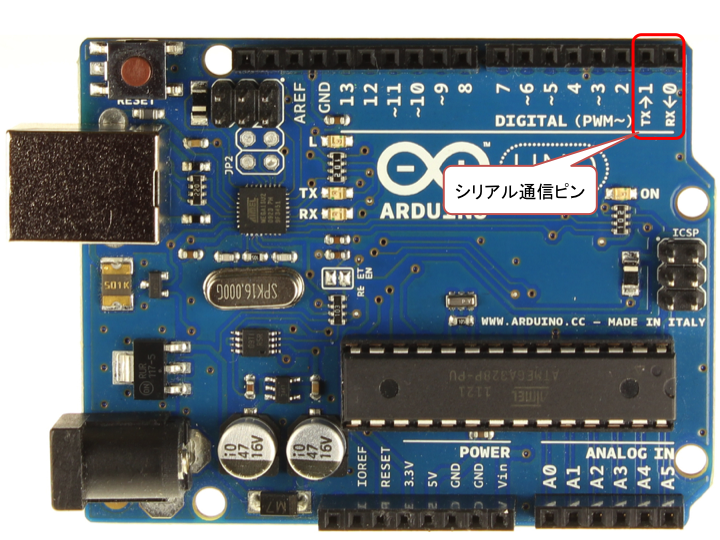

#CPSLAB Arduino Tutorial
この資料はCPSLABのゼミ生に向けたものです．
２０１６年度の前期ゼミではArduinoによるシリアル通信，Grove規格のセンサーとの連携を扱います．

##導入スライド
Arduino講習

#シリアル通信とは
シリアル通信は、電気通信において伝送路上を一度に1ビットずつ，逐次的にデータを送ることをいう，また，コンピュータにおいては，バス上を一度に1ビットずつ，逐次的にデータを送ることをいう．(Wikipedia-シリアル通信)

電子工作においてはマイコンとセンサ，マイコンとパソコン間の通信をするために多く使われる基本的な通信方法．

Arduinoでシリアル通信を行う場合は０番ピン（RX:受信）と１番ピン（TX：送信）に対応する信号を送ることによって行う．
このピンはArduinoのUSB端子にもつながっていてプロブラムを書き込むときにもシリアル通信を使って書き込んでいる．

